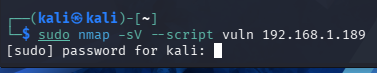
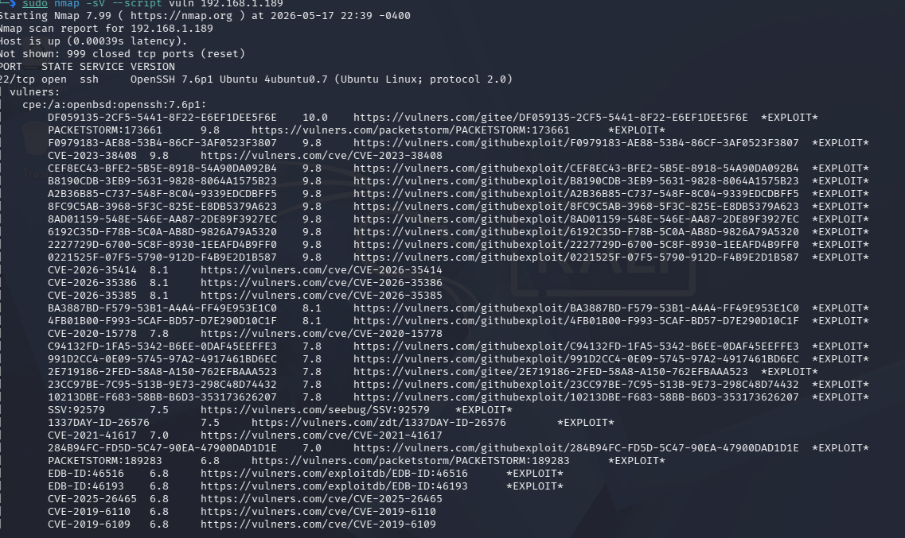
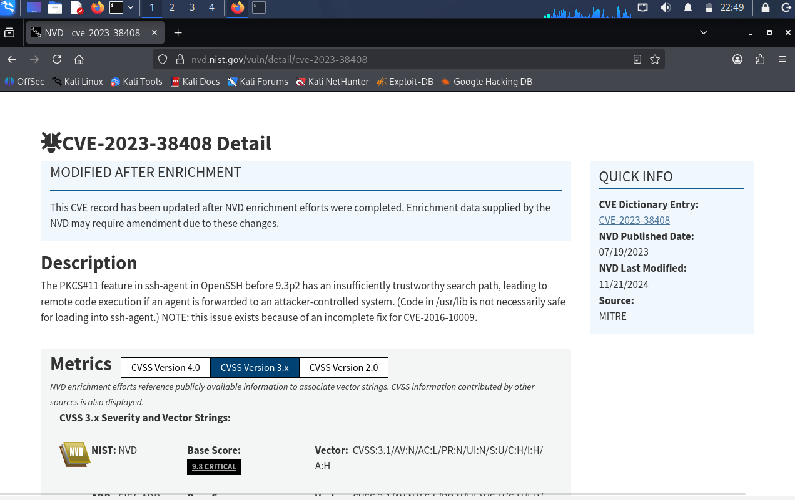
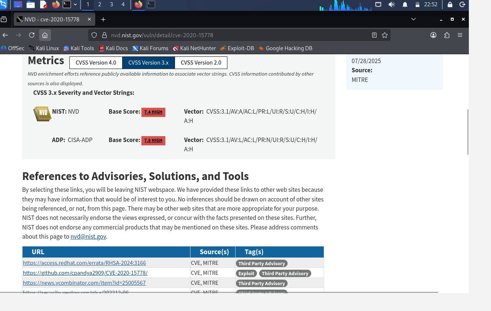
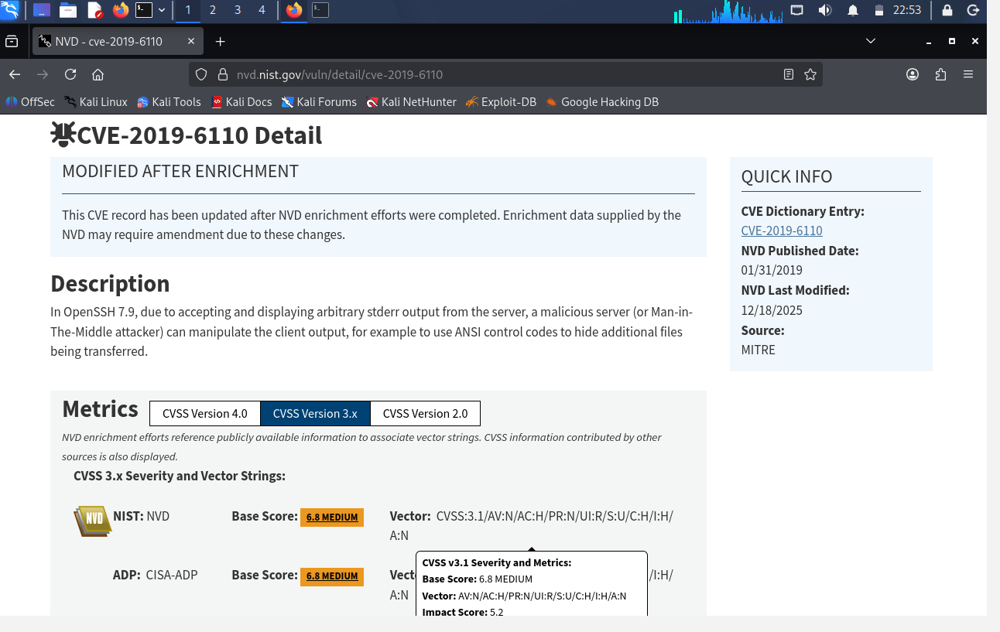
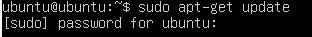
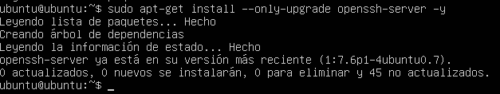
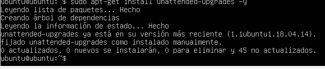
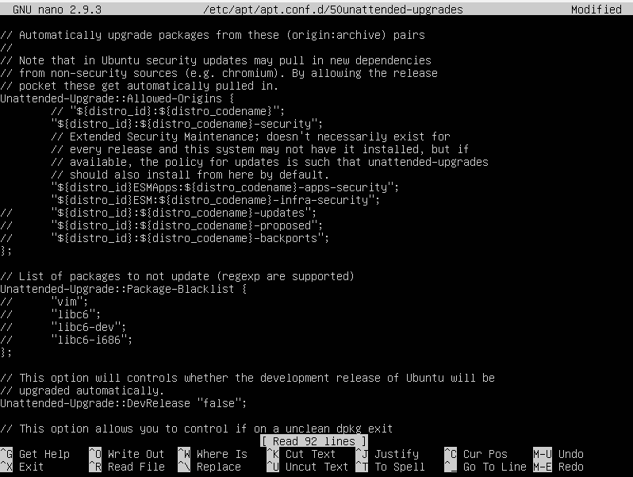

# Lab 1. Practica de defensa activa

## Finalidad del Laboratorio

La finalidad de esta práctica es implementar una estrategia de Defensa en Profundidad mediante la mitigación proactiva de la superficie de exposición de un servidor. Los servidores de producción no pueden actualizarse de manera masiva y descuidada, ya que parches mal testeados podrían quebrar dependencias críticas y tumbar servicios esenciales. 

Por lo tanto, este laboratorio tiene como propósito técnico aislar y automatizar exclusivamente el canal de parches críticos de seguridad, logrando que el sistema operativo se proteja de manera autónoma ante exploits públicos.

---

## Herramientas Utilizadas
Para el desarrollo de esta simulación defensiva se emplearon los siguientes recursos tecnológicos:
* **Sistema Operativo Víctima:** Ubuntu Server (entorno desactualizado simulando un servidor corporativo en producción).
* **Sistema Operativo Atacante:** Kali Linux.
* **Unattended-Upgrades:** Paquete y servicio de Linux diseñado para automatizar la instalación de software y parches de seguridad de manera desatendida.

---

## Análisis de Vulnerabilidades (Fase de investigacion)

Se realizó una auditoría basada en las bases de datos del **NVD (National Vulnerability Database - NIST)** para comprender el impacto real de las vulnerabilidades presentes en versiones desactualizadas de OpenSSH.

1. **Vulnerabilidades Críticas Analizadas:**
   * **CVE-2023-38408 (Base Score: 9.8 CRITICAL):** Fallo en la característica PKCS#11 de `ssh-agent` que permite la ejecución remota de código (RCE) si un agente es reenviado a un sistema controlado por un atacante.
   * **CVE-2020-15778 (Base Score: 7.4 / 7.8 HIGH):** Vulnerabilidad en el comando `scp` que permite la inyección y ejecución de comandos maliciosos a través de la transferencia de archivos.
   * **CVE-2019-6110 (Base Score: 6.8 MEDIUM):** Vulnerabilidad de manipulación de salida donde un servidor malicioso (Man-in-the-Middle) puede usar códigos de control ANSI para ocultar archivos adicionales transferidos.

---

## Desarrollo del Laboratorio y Evidencias

A continuación, se detallan los pasos técnicos ejecutados en la consola del servidor Ubuntu para verificar el estado de los paquetes y configurar la automatización de las defensas.

Aqui se pone un codigo para poder escanear mediante la maquina kali hacia la victima que estaria desactualizada, rdta contiene los parametros -sV para detectar servicios que estan en funcionamiento en la maquina, Ademas usamos el script vuln para detectar las vulnerabilidades que fueron detectadas.

Aqui podemos ver el resultado del escaneo

Vulnerabilidad 1: CVE-2023-38408

Severidad según NVD: Crítica (Base Score: 9.8)

Clasificación de Impacto: RCE (Ejecución Remota de Código)

Hallazgo: De acuerdo con los datos del NIST/NVD, el componente ssh-agent en versiones de OpenSSH anteriores a la 9.3p2 gestiona de forma incorrecta las rutas de búsqueda para la función PKCS#11. Esto permite que un atacante que logre que la víctima le reenvíe su agente SSH pueda ejecutar código arbitrario y comandos remotos maliciosos aprovechando las librerías del sistema (/usr/lib).

Vulnerabilidad 2: CVE-2020-15778
Severidad según NVD: Alta (Base Score: 7.8 HIGH).

¿Qué permite hacer?: RCE (Ejecución Remota de Código).

Hallazgo: La captura de la base de datos muestra que este fallo afecta a la función scp de OpenSSH. Un atacante puede realizar una inyección de comandos maliciosos a través de los nombres de los archivos transferidos. Dado que el destino ejecuta las operaciones mediante el shell, se logra la ejecución de código no autorizado con los privilegios del usuario.

Vulnerabilidad 3: CVE-2019-6110
Severidad según NVD: Media (Base Score: 6.8 MEDIUM).

¿Qué permite hacer?: Manipulación de archivos / RCE Indirecto.

Hallazgo: El cliente OpenSSH acepta y muestra salidas de error (stderr) del servidor. Un atacante que realice un ataque Man-in-the-Middle (MitM) o que controle un servidor malicioso puede usar códigos de control ANSI para manipular la salida de la terminal del cliente y ocultar o alterar archivos críticos durante la transferencia, lo que compromete la integridad del sistema.

Aqui se actualiza

Aqui aplicamos el parche a los servicios

Aqui se configuran las actualizaciones automaticas de seguridad

Aqui ponemos el comando nano para entrar a la configuracion y configurar el unattended 

aqui podemos ver que se configuro las actualizaciones automaticas que sean solo acerca de seguridad

