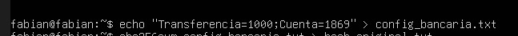
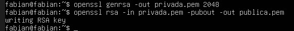
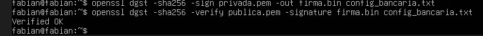
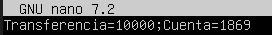
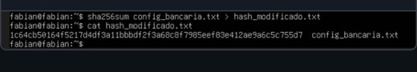
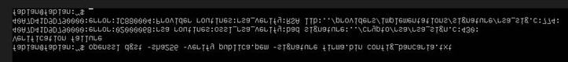

Laboratorio Práctico 1: Integridad de Datos y Firma Digital

El laboratorio fue desarrollado utilizando Ubuntu Server. En este entorno se simularon procesos relacionados con la seguridad de la información, específicamente en la verificación de integridad y el uso de firmas digitales.

Descripción de la Actividad:
La actividad consistió en aplicar mecanismos criptográficos para proteger un archivo considerado crítico. Para ello, se utilizó el algoritmo SHA-256 para generar una huella digital del archivo, además de herramientas como OpenSSL para la creación de claves y la firma digital.

Dinámica:
Generación de Hash crea un archivo config_bancaria.txt. Usa sha256sum para generar su huella digital.
Simulación de Ataque: Un "atacante" modifica un solo carácter (ej: cambia un 0 por un 1 en un monto).
Verificación: El alumno vuelve a correr el hash y nota que la "huella" es totalmente distinta.
Firma Digital (OpenSSL):
Generar llave privada: openssl genrsa -out privada.pem 2048
Generar llave pública: openssl rsa -in privada.pem -pubout -out publica.pem
Firmar archivo: openssl dgst -sha256 -sign privada.pem -out firma.bin config_bancaria.txt

Que se hará en el lab:
En esta actividad se generará un archivo que representará una configuración bancaria simulada. se le aplicará un algoritmo hash (SHA-256) con el fin de obtener su huella digital.
Posteriormente, se realizará una modificación mínima en el contenido del archivo, simulando una posible alteración o ataque. Luego de este cambio, se volverá a calcular el hash para comparar los resultados y comprobar si existen diferencias.
Además, se llevará a cabo la generación de un par de claves criptográficas, una pública y otra privada. Estas serán utilizadas para firmar digitalmente el archivo.

Finalidad del Laboratorio
El propósito de este laboratorio fue comprender cómo funcionan los mecanismos criptográficos aplicados a la seguridad de la información. se buscó entender el uso de funciones hash como SHA-256 y su capacidad para detectar cambios en los datos.

Evidencias:

Primero que nada se crea el archivo

Luego se realiza el Hash

En esta parte verificamos el Hash

Aqui creamos las llaves

luego realizamos la firma y la verificacion de esta

Simulamos el ataque, pero se hace cambios a los caracteres

Se genera el hash al nuevo archivo que se modificó recientemente, como se muestra en la imagen el hash cambio

Se vuelve a verificar la firma y se puede ver que esta falla

