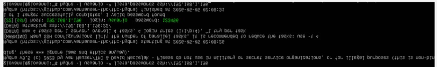
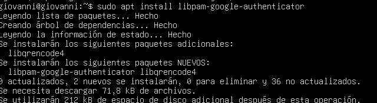
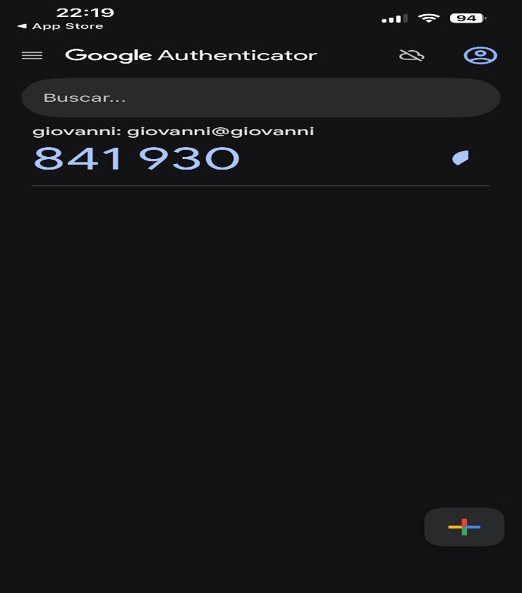
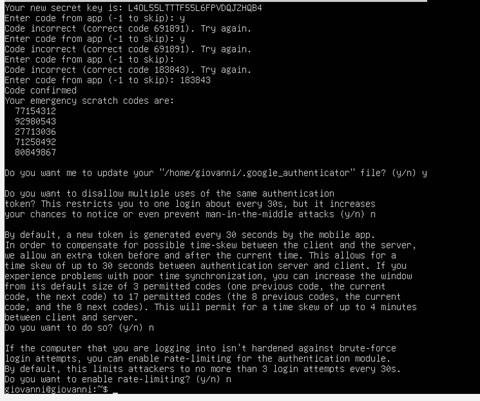
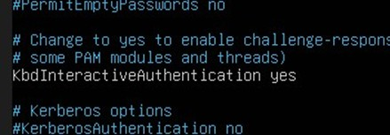
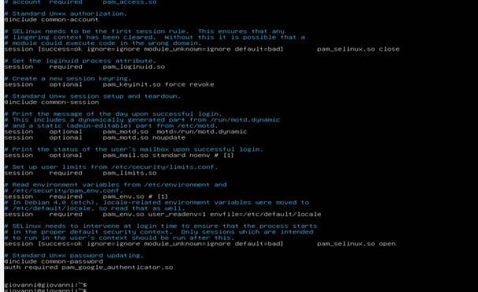

Laboratorio 2: Ataque y Protección de Credenciales (MFA)
Descripción de la Actividad
En este laboratorio se trabajará con técnicas de ataque a credenciales y posteriormente con mecanismos de defensa. El objetivo principal es demostrar cómo una contraseña débil puede ser comprometida fácilmente y cómo la implementación de un segundo factor de autenticación mejora significativamente la seguridad.

Para ello, se utilizarán herramientas como Hydra para realizar ataques de diccionario contra el servicio SSH, y posteriormente se configurará autenticación multifactor (MFA) mediante el uso de Google Authenticator.

¿Qué se realizará?
En una primera etapa, se llevará a cabo un ataque desde la máquina atacante hacia el servidor víctima utilizando Hydra. Este ataque se basará en un diccionario de contraseñas con el fin de descubrir una clave débil asociada a un usuario del sistema.

Una vez obtenida la contraseña, se procederá a reforzar la seguridad del servidor implementando un sistema de autenticación multifactor (MFA). Para esto, se instalará y configurará el módulo de Google Authenticator en el servidor, vinculándolo con una aplicación en el dispositivo móvil.

Finalmente, se repetirá el ataque inicial para comprobar el efecto de la nueva configuración. Aunque la contraseña sea correcta, el acceso debería ser denegado debido a la falta del segundo factor de autenticación.

HERRAMIENTAS

Ubuntu server victima

Ubuntu server atacante

Hydra

Google Authenticator

ssh

Demostracion:

aquí se realiza el ataque con hydra y como se puede visualizar el ataque fue exitoso, donde se consiguió la contraseña y el usuario

Ahora en la maquina víctima se instala Google authenticator para reforzar la seguridad

Cuando ya esté en funcionamiento Google authenticator, este nos mostrará un código QR en el cual hay que escanear con el teléfono y a la hora de escanearlo nos saldrá esto

Luego se procede a terminar de configurar el google authenticator

Configuracion ssh

Ahora se intenta hacer el login de nuevo desde la maquina atacante y como se puede ver pide contraseña y código de Google authenticator

Finalmente se realiza denuevo el ataque mediante hydra y funciona de manera igual que antes, pero este fallaría gracias a mfa

