Laboratorio 3: Protocolos de Comunicación Seguros
Descripción de la Actividad

En este laboratorio se analizará la diferencia entre una comunicación insegura y una protegida mediante protocolos de seguridad. El objetivo principal es observar cómo la información enviada por una red puede ser interceptada cuando no existe cifrado y cómo herramientas como HTTPS, túneles SSH y VPN ayudan a proteger los datos.

Para el desarrollo de la actividad se utilizará Wireshark para capturar y analizar tráfico de red, además de servicios web configurados en un servidor Ubuntu.

¿Qué se realizará?

En una primera etapa se configurará un servidor web utilizando HTTP. Posteriormente, desde otra máquina se accederá a un formulario simple mientras se monitorea el tráfico con Wireshark. Esto permitirá visualizar información transmitida en texto plano, como nombres de usuario o contraseñas.

Luego, se implementarán mecanismos de seguridad para proteger la comunicación. Entre ellos, la configuración de HTTPS mediante certificados SSL y la creación de un túnel SSH para cifrar el tráfico entre cliente y servidor.

Finalmente, se volverá a analizar la red utilizando Wireshark con el objetivo de comprobar que la información ya no puede visualizarse de manera legible gracias al cifrado aplicado.

HERRAMIENTAS

Ubuntu Server (Servidor Web)

Kali Linux

Wireshark

Apache

SSH

SSL
¿Qué se observará?
Captura de tráfico HTTP sin cifrado utilizando Wireshark.
Visualización de información transmitida en texto plano.
Configuración de HTTPS en el servidor web.
Creación de un túnel SSH para proteger la comunicación.
Diferencia entre tráfico inseguro y tráfico cifrado.
Verificación de que la información ya no es legible tras aplicar seguridad.

La finalidad de este laboratorio es comprender la importancia de proteger las comunicaciones dentro de una red. A través del análisis de tráfico se podrá evidenciar cómo protocolos inseguros permiten interceptar información sensible.

DEMOSTRACION:

Primero que nada, en la maquina que se atacara se instala apache para asi poder levantar la pagina, Luego verificamos que ese este en funcionamiento y levantado

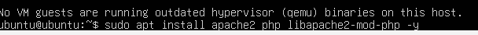

Luego modificaremos el archivo index.html para asi poder rellenarlo

Aqui se rellena el index.html con algo simple para poder hacer el login

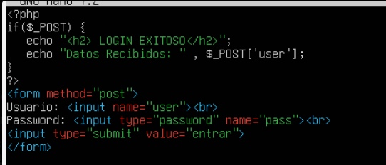

Aqui se instala wireshark en la maquina

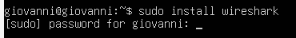

Aqui se mostrarian las interfaz en la cual habria que elegir la que estaria usando las maquinas virtuales

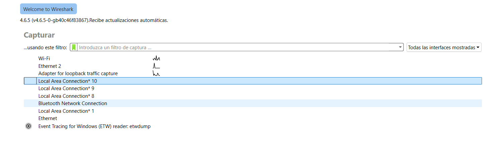

Aqui se pondria el filtro en el cual estariamos trabajando, seria el metodo post

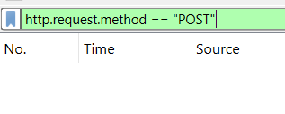

Ahora para interceptar el trafico con wireshark necesitamos ir a la pagina que hicimos y inciar con la credencial para poder interceptar los datos

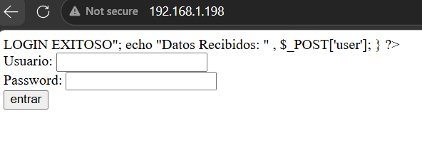

Como se puede ver en wireshark, si estaria interceptando con exito las credenciales ingresadas

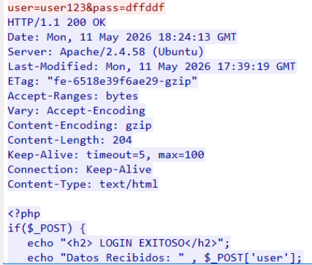

Para poder evitar que los datos viajen en texto plano, seria implementar un tunel ssh

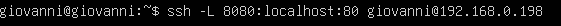

Ahora si se cambia el filtro a ssh se puede ver que lo interceptado ahora estaria incriptado, en el cual estaria bien

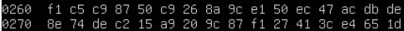

Ahora se hara la creacion de llaves mediante los comandos que se vera ahora

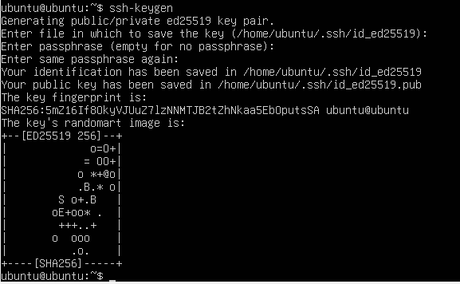

La llave es agregada al servidor

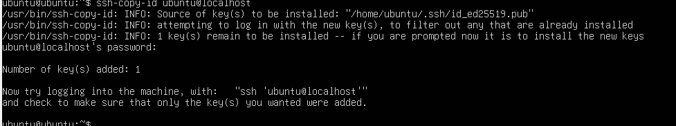

aqui se configura el archivo ssh para desactivar que nos pida la autenticaicon mediante la contrasena

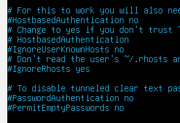

Aqui podemos ver una ves puesto el comando para la conexion ssh no nos pide la contra y solo la clave de la llave de acceso que hicimos anteriormente.

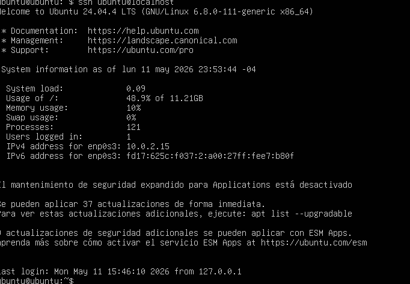

Ahora para finalizar pasamos a la etapa de implementacion de ssl, Aca creamos el certificado ssl.

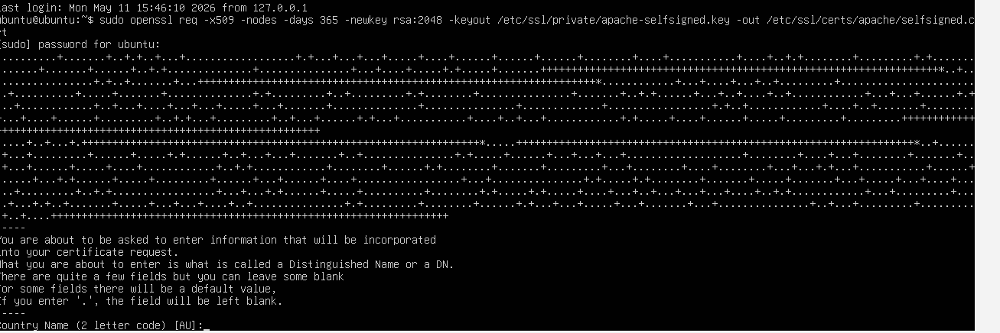

Aca activamos el ssl en apache con los siguentes comandos

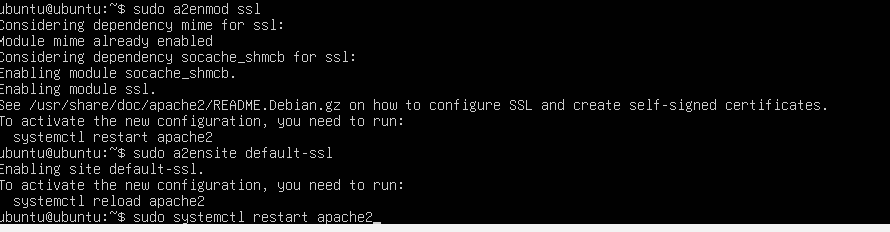

configuracion archivo ssl

Aqui se pude ver que con las configuraciones ya se puede entrar mediante esta url y coon eso se puede abrir wirehsark y ingresar la credneciales de la pagina para interceptarlas.

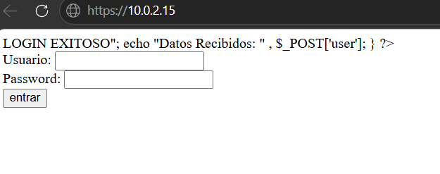

