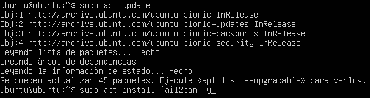
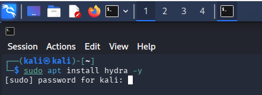
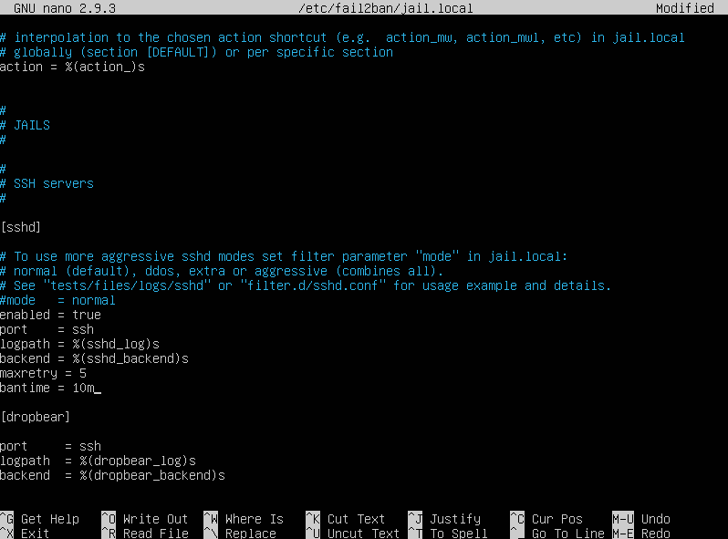
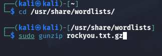
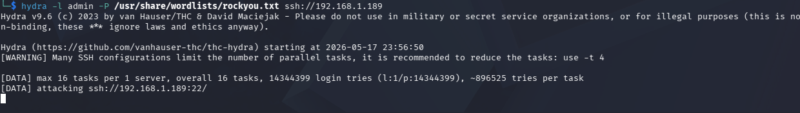
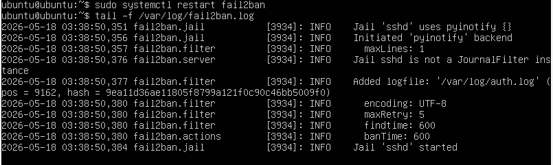
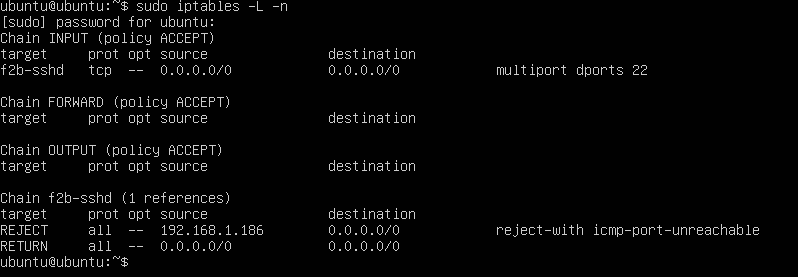
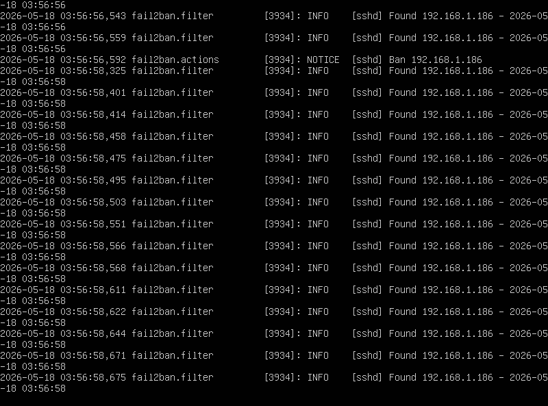

Lab 2. implementación de IDS con Snort o Fail2Ban (Habilidad: Aplicar IDS)

Entorno: Ubuntu Server (Víctima) y Kali (Atacante).
Actividad: Configurar un sistema de detección y respuesta automática.

Tarea:

Instalar Fail2Ban para proteger el servicio SSH.
Lanzar un ataque de fuerza bruta desde Kali con hydra.
Verificar en los logs cómo el IDS detecta el ataque y bloquea la IP del atacante automáticamente en el firewall (iptables).

Dinámica:

Instalación y Configuración: Instalar Fail2Ban en Ubuntu.
sudo apt install fail2ban
Configurar un archivo jail.local para monitorear el log de /var/log/auth.log.

El Ataque: Desde Kali, lanzar una ráfaga de intentos fallidos.

hydra -l admin -P /usr/share/wordlists/rockyou.txt ssh://[IP_Víctima]

Observación: En el Ubuntu, el alumno debe monitorear el archivo de log: tail -f /var/log/fail2ban.log.

Verificación de Defensa: Ver cómo la IP de Kali es baneada automáticamente en el firewall.
sudo iptables -L -n

## Finalidad del Laboratorio
La finalidad de esta práctica es diseñar e implementar un mecanismo de **Respuesta Automática ante Incidentes** mediante el despliegue de un Sistema de Detección de Intrusos (IDS) basado en host. Dado que el puerto del servicio SSH se encuentra expuesto en el servidor, un atacante externo podría intentar vulnerar el sistema mediante ráfagas continuas de adivinación de contraseñas. 

El propósito de este laboratorio es configurar una lógica defensiva perimetral interna capaz de auditar los registros de acceso en tiempo real, identificar patrones anómalos (múltiples intentos de inicio de sesión fallidos en un corto intervalo de tiempo) e interactuar dinámicamente con el cortafuegos (`iptables`) del núcleo del sistema operativo para neutralizar de raíz la IP del atacante antes de que logre comprometer el servidor.

---

## Herramientas Utilizadas
Para el desarrollo de esta simulación defensiva y ofensiva se emplearon los siguientes recursos tecnológicos:

* **Sistema Operativo Víctima:** Ubuntu Server.
* **Sistema Operativo Atacante:** Kali Linux.
* **Fail2Ban:** Sistema de prevención de intrusos basado en software que escanea archivos de log y bloquea direcciones IP sospechosas.
* **Hydra:** Herramienta de cracking de inicios de sesión en paralelo rápida y flexible, utilizada para simular la amenaza.
* **Rockyou.txt:** Diccionario estándar de auditorías de contraseñas de seguridad de la información que almacena millones de cadenas de texto de uso común.
* **Iptables:** Filtro de paquetes nativo del kernel de Linux utilizado para aplicar las reglas de baneo y denegación de tráfico.

---

## Desarrollo del Laboratorio y Evidencias

A continuación, se describen de manera cronológica los pasos técnicos ejecutados en ambas máquinas virtuales para la instalación, simulación del ataque, monitoreo en tiempo real y verificación de las defensas.

En la consola de Ubuntu Server, se ejecutó la instalación del servicio fail2ban.

ahora se instala hydra

La captura confirma la ejecución limpia del comando de clonación, lo que permite generar un entorno de configuración aislado y seguro siguiendo las buenas prácticas de administración de sistemas Linux.

En esta captura del archivo de configuración, se observa la parametrización de la jaula [sshd]. Se habilitó el servicio (enabled = true), se asignó el puerto estándar y se apuntó explícitamente al registro de auditoría de accesos del sistema (logpath = /var/log/auth.log). Además, se definieron las políticas críticas de baneo: un límite estricto de 5 reintentos fallidos (maxretry) y un tiempo de mitigación de 10 minutos (bantime = 10m). Luego de guardar, se aplicaron los cambios reiniciando el servicio.

El sistema operativo Kali incluye de manera nativa el diccionario de contraseñas corporativo rockyou.txt

Esta evidencia muestra a Hydra iniciando el bombardeo masivo de peticiones SSH de forma simultánea. El software empieza a testear combinaciones a alta velocidad, lo que genera intencionalmente un comportamiento anómalo masivo en los registros del servidor con el fin de forzar

Aqui se ve el monitoreo

defensa

Fail2Ban detectó que la máquina atacante (Kali Linux con la IP 192.168.1.186) superó el límite de 5 intentos fallidos que le configuraste en el archivo jail.local, y procedió a bloquearla de inmediato.

